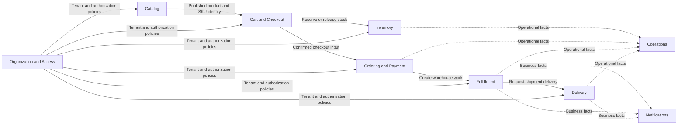

# NexusFlow Initial Context Map

## Important distinction

A bounded context is a business-language and ownership boundary. It is not automatically a separately deployed microservice.

NexusFlow initially deploys these contexts inside a modular monolith and a separate worker. Selected contexts are extracted only after their boundaries and failure modes are proven.

## Logical contexts

| Context | Owns |
| --- | --- |
| Organization and Access | Organizations, users, memberships, roles, invitations, sessions, and authorization policies |
| Catalog | Categories, products, variants, SKUs, product media metadata, and catalog visibility |
| Cart and Checkout | Guest/server cart behavior, cart merge, checkout preparation, pricing coordination, and shipping quote selection |
| Inventory | Warehouse stock balances, reservations, stock movements, expiration, and reconciliation |
| Ordering and Payment | Payment attempts, commercial order snapshots, order state, cancellation rules, and Saga orchestration |
| Fulfillment | Warehouse tasks, picking, packing, handoff, and missing-item exceptions |
| Delivery | Courier availability, assignment, route state, location, and delivery verification |
| Notifications | Persistent notifications, email jobs, and real-time delivery |
| Operations | Operational read models for orders, Sagas, warehouses, couriers, failures, and historical aggregates |

## Core relationship flow



Solid arrows represent direct business requests or supplied identity. Dotted arrows represent facts consumed for notifications or operational projections.

## Ownership rules

- Catalog owns product, variant, and SKU definitions.
- Inventory owns stock truth and reservation decisions.
- Cart and Checkout may request inventory changes but cannot manufacture availability.
- Ordering and Payment owns commercial order state and payment reconciliation.
- An Order is a commercial transaction; a Shipment is a physical fulfillment unit.
- Fulfillment owns warehouse execution state.
- Delivery owns courier and proof-of-delivery state.
- Notifications cannot change the validity of an order.
- Operations read models cannot authorize users or decide stock and payment truth.
- Tenant scope is enforced at every tenant-owned boundary.

## Initial deployment

```text
commerce-api
|-- organization-and-access
|-- catalog
|-- cart-and-checkout
|-- inventory
|-- ordering-and-payment
|-- fulfillment
|-- delivery
|-- notifications
`-- operations

worker
|-- delayed jobs
|-- retries
|-- reconciliation
`-- background side effects
```

The initial phase may use one shared PostgreSQL schema, but each module still has explicit data ownership. Sharing a database does not grant permission for arbitrary cross-module writes.

## Planned extraction direction

| Future component | Context ownership |
| --- | --- |
| Commerce Core | Organization and Access, Catalog, Cart and Checkout, Ordering and Payment, and Saga orchestration |
| Inventory Service | Inventory |
| Fulfillment Service | Fulfillment |
| Delivery Service | Delivery |
| Notification Worker | Notification projections, email jobs, and real-time delivery |

Service extraction does not begin until the modular-monolith flow works and baseline behavior can be compared before and after extraction.
